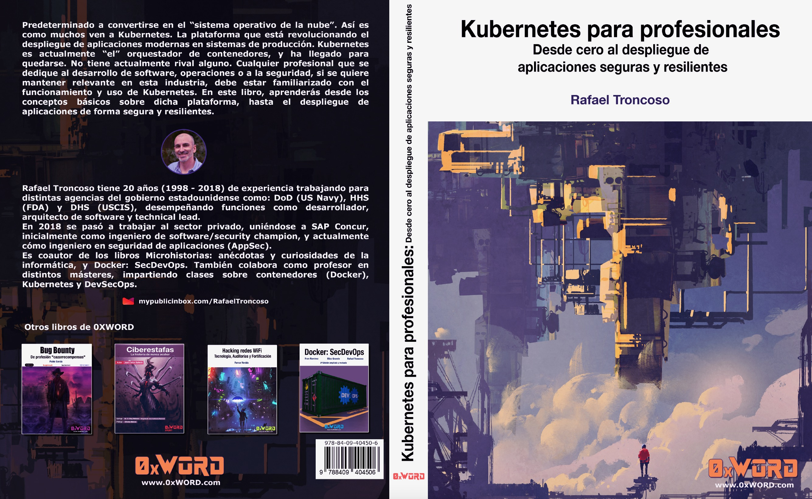

# Kubernetes para profesionales. Desde cero al despliegue de aplicaciones seguras y resilientes

El libro se puede adquirir en la [web de 0xWord](https://0xword.com/es/libros/213-kubernetes-para-profesionales-desde-cero-al-despliegue-de-aplicaciones-seguras-y-resilientes.html).

Este repositorio contiene los ejemplos usados en el libro.